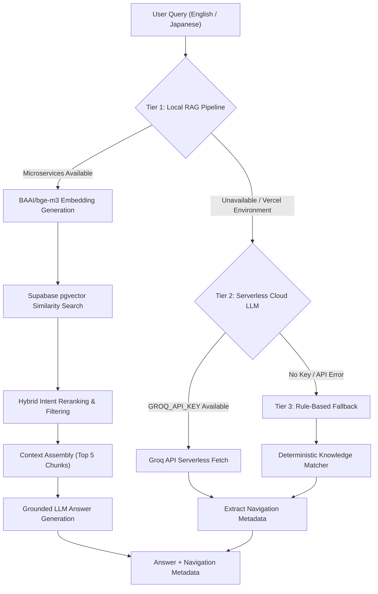

# RAG-Powered Portfolio AI Assistant

A production-ready, bilingual Retrieval-Augmented Generation (RAG) conversational assistant integrated into Sujan K S's personal portfolio website. Built with **Next.js (App Router)**, **TypeScript**, **Supabase pgvector**, and **BAAI/bge-m3 embeddings**, the assistant answers visitor and recruiter questions about Sujan's profile, education, technical skills, projects, work experience, achievements, developer profiles, and contact details in both **English and Japanese**.

Beyond standard chat answering, the system features **AI-Driven UI Section Navigation** that automatically directs the portfolio browser to relevant sections and specific project cards in sync with the conversation.

---

## Overview

The **RAG-Powered Portfolio AI Assistant** serves as an interactive, intelligent guide for recruiters and hiring managers. Instead of statically browsing pages, visitors can ask natural-language questions such as *"Tell me about GeoSentinel"*, *"What are Sujan's technical skills?"*, or *"Show me his FlyRank internship experience"*.

The system executes semantic search over a curated Markdown knowledge base, synthesizes grounded answers using a grounded LLM generator, and emits structured navigation metadata to scroll to and highlight relevant portfolio elements smoothly.

---

## Key Features

- **Bilingual RAG Pipeline**: Full English and Japanese support leveraging multilingual dense embeddings (**BAAI/bge-m3**).
- **3-Tier AI Assistant Cascade**:
  - **Tier 1 (Local RAG)**: Full hybrid vector retrieval, context assembly, and grounded LLM generation.
  - **Tier 2 (Cloud LLM Fallback)**: Serverless HTTP `fetch`-based fallback via Groq API (`llama-3.3-70b-versatile` / `qwen/qwen3.8-27b`) when local Python binaries or vector microservices are unavailable (e.g. Vercel deployment).
  - **Tier 3 (Rule-Based Fallback)**: Deterministic fallback matching for basic facts and route guidance when external APIs are unconfigured or offline.
- **Controlled Portfolio Navigation**: Emits structured `{ section, target }` metadata to smoothly scroll the viewport to specific sections and target project cards without direct DOM manipulation by the LLM.
- **Target Project Highlighting**: Automatically triggers pulse-highlighting animations on targeted project cards upon arrival.
- **Short-Term Conversational Memory**: Resolves pronouns and entity references across multi-turn queries (e.g., *"Tell me about GeoSentinel."* → *"What technologies were used in it?"*).
- **Zero-Hallucination Grounding**: Instructed to answer strictly using retrieved context chunks, preserving exact metrics (e.g., CGPA 8.56, degree specs, project statuses).

---

## System Architecture

The AI assistant operates on a 3-tier cascade designed for local development performance and serverless cloud reliability:



---

## RAG Pipeline

The primary local RAG pipeline follows an end-to-end grounded retrieval lifecycle:

1. **Markdown Knowledge Ingestion**: Curated Markdown documents organized by language (`knowledge/en/` and `knowledge/ja/`).
2. **Semantic Chunking**: Split into section-aware Markdown chunks with rich headers and metadata.
3. **Multilingual Vector Embedding**: Encoded using **BAAI/bge-m3** (1024-dimensional dense vectors).
4. **Supabase Vector Storage**: Stored in the `knowledge_embeddings` table with cosine similarity indexing (`vector(1024)`).
5. **Hybrid Retrieval & Reranking**: Combines cosine similarity scoring with intent-based keyword score boosting.
6. **Context Assembly**: Top 5 relevant chunks are assembled into a structured prompt context (up to 2,500 characters).
7. **Grounded Answer Generation**: Formatted for natural, conversational delivery without hallucinating unverified facts.

---

## 3-Tier AI Assistant Cascade

| Tier | Component | Environment | Execution Details |
| :--- | :--- | :--- | :--- |
| **Tier 1** | **Local RAG Pipeline** | Local Development | BAAI/bge-m3 (1024d) + Supabase pgvector + Persistent Python Embedding/LLM service. |
| **Tier 2** | **Serverless Cloud LLM Fallback** | Vercel / Cloud Serverless | Native `fetch()` call to Groq API (`llama-3.3-70b-versatile` / `qwen/qwen3.8-27b`) with embedded knowledge facts. Does not require Python or local binaries. |
| **Tier 3** | **Rule-Based Fallback** | Universal Safety Layer | Deterministic pattern matcher executing over structured portfolio facts in `knowledge.ts`. Guaranteed zero 500 errors. |

---

## Multilingual Support

The assistant provides bilingual coverage across both **English** and **Japanese**:

- Multilingual vector search via **BAAI/bge-m3**.
- Section & target navigation for English and Japanese queries.
- Cloud LLM fallback responses in English and Japanese.
- Rule-based fallback answers in both languages.
- Target project card highlighting upon navigation.

---

## AI-Powered Portfolio Navigation

The AI Assistant does not merely reply with text; it actively navigates the UI to the exact portfolio content discussed.

### Navigation Examples

| User Prompt (English / Japanese) | Target Section | Target Item ID |
| :--- | :--- | :--- |
| *"Tell me about GeoSentinel."* | `projects` | `geosentinel` |
| *"GeoSentinelについて教えてください。"* | `projects` | `geosentinel` |
| *"Tell me about Sujan's FlyRank internship."* | `experience` | `flyrank` |
| *"What are Sujan's technical skills?"* | `skills` | — |
| *"Tell me about Sujan's education."* | `about` | `education` |
| *"What are Sujan's achievements?"* | `achievements` | — |
| *"How can I contact Sujan?"* | `contact` | — |

### Navigation Response Metadata

The API returns provider-independent navigation metadata:

```json
{
  "answer": "GeoSentinel is an AI-powered landslide detection system using YOLOv8 segmentation...",
  "navigation": {
    "section": "projects",
    "target": "geosentinel"
  }
}
```

The frontend handles smooth scrolling and component highlighting using controlled targets rather than letting the LLM execute arbitrary DOM manipulation.

---

## Stable Project Targeting

Stable navigation IDs allow the assistant to scroll directly to specific project cards:

- `geosentinel` — GeoSentinel (AI Landslide Detection System)
- `smartq-generator` — SmartQ Generator (AI Question Generator)
- `rag-portfolio-ai-assistant` — RAG-Powered Portfolio AI Assistant
- `invoice-data-to-json-parser` — Hybrid AI Invoice Data to JSON Parser
- `car-pedestrian-detection` — Car & Pedestrian Detection System
- `banking-management-system` — Banking Management System
- `colorectal-polyp-temporal-validation` — Colorectal Polyp Temporal Validation
- `ai-face-generation` — AI Human Face Generation (WGAN-GP)
- `text-anomaly-detection` — Text Anomaly Detection System
- `ecommerce-dashboard` — E-Commerce Sales Dashboard (Power BI)

---

## Conversational Memory

The assistant maintains short-term conversational context across follow-up queries (window size: 6 messages):

**Example Sequence:**

> **User:** *"Tell me about GeoSentinel."*  
> **Assistant:** *"GeoSentinel is an AI landslide detection system built using YOLOv8 segmentation..."*  
> **User:** *"What technologies were used in it?"*  
> **Resolver:** Resolves `"it"` → `"GeoSentinel"` and queries RAG for GeoSentinel's tech stack.

---

## Knowledge Base

Portfolio facts are stored as structured Markdown files divided by language:

```
knowledge/
├── en/
│   ├── QUESTIONS.md
│   ├── about.md
│   ├── achievements.md
│   ├── certifications.md
│   ├── education.md
│   ├── experience.md
│   ├── profiles.md
│   ├── projects.md
│   └── skills.md
└── ja/
    ├── QUESTIONS.md
    ├── about.md
    ├── achievements.md
    ├── certifications.md
    ├── education.md
    ├── experience.md
    ├── profiles.md
    ├── projects.md
    └── skills.md
```

---

## Embedding Pipeline

```
Markdown Knowledge Files (EN & JA)
                ↓
    Section-Level Knowledge Chunking
                ↓
   BAAI/bge-m3 Dense Vector Embedding
                ↓
    1024-Dimensional Floating Vectors
                ↓
          embeddings.json
                ↓
  Supabase pgvector (knowledge_embeddings)
                ↓
   Cosine Similarity Vector Retrieval
```

### Knowledge Statistics

- **Total Chunks**: `596`
- **English Chunks**: `332`
- **Japanese Chunks**: `264`
- **Embedding Dimensions**: `1024`
- **Model**: `BAAI/bge-m3`

---

## Vector Database

- **Platform**: Supabase PostgreSQL
- **Extension**: `pgvector`
- **Table Name**: `knowledge_embeddings`
- **Index**: Cosine similarity (`vector_cosine_ops`)

> **Security Note**: All Supabase service role keys and API credentials are kept strictly private in environment configuration (`.env.local`).

---

## Cloud & Vercel Deployment Architecture

```
[Local Development Environment]
Portfolio App ──> Local RAG Pipeline ──> Persistent BGE-M3 Python Service ──> Supabase pgvector

[Vercel Serverless Deployment]
Portfolio App ──> RAG Check ──> Tier 2 Cloud LLM Fallback (Groq API fetch) ──> Tier 3 Rule Fallback
```

The 3-tier cascade guarantees that deployed serverless instances on Vercel respond reliably without needing heavy C++ or PyTorch dependencies in the serverless bundle.

---

## Output & Visual Interface


*Interactive AI Assistant interface featuring bilingual conversation, auto-scrolling navigation, and grounded response rendering.*

---

## Verified Test Results

### 3-Tier Cascade Verification

- **Normal Local RAG Query**: **PASS**
- **GeoSentinel RAG Target Query**: **PASS**
- **FlyRank Internship Query**: **PASS**
- **Tier 2 Cloud LLM Fallback**: **PASS**
- **Tier 3 Rule-Based Fallback**: **PASS**
- **Japanese Navigation Metadata**: **PASS**
- **Conversational Context Resolution**: **PASS**

### Bilingual Parity Audit

- **English Feature Parity**: **17 / 17 PASS (100%)**
- **Japanese Feature Parity**: **17 / 17 PASS (100%)**

---

## Known Limitations

- **Complex Japanese Referential Ambiguity**: While explicit Japanese demonstratives (`そのプロジェクト`, `そこで`, `それは`) resolve to previous entities, complex or implicit Japanese referential expressions have more limited resolution support compared to English pronouns (`it`, `this`, `that`).
- **Rule Fallback String Language**: Tier 3 rule fallback facts in `knowledge.ts` return exact fact strings in English.

---

## Tech Stack

- **Frontend / Framework**: Next.js 16 (App Router), TypeScript, React 19, Tailwind CSS, Framer Motion, Lucide React
- **Database / Vector Search**: Supabase, PostgreSQL, `pgvector`
- **Embeddings & AI**: BAAI/bge-m3 (Sentence Transformers), PyTorch, Python 3.9 (FastAPI embedding service)
- **LLM Providers**: Grok (xAI API) / Groq API (`llama-3.3-70b-versatile` / `qwen/qwen3.8-27b`)
- **Deployment**: Vercel

---

## Repository Structure

```
portfolio/
├── app/
│   ├── api/chat/route.ts        # 3-Tier AI Cascade API endpoint
│   ├── layout.tsx              # Root layout & providers
│   └── page.tsx                # Portfolio homepage
├── src/
│   ├── components/
│   │   ├── AI/                 # AIAssistant, AIChatWindow, AIMessage components
│   │   └── TouchpadGestureNavigation.tsx  # Horizontal touchpad swipe handler
│   └── lib/
│       ├── navigation.ts        # Controlled section scroll & highlighting
│       ├── navigationTarget.ts  # Target pattern matcher & metadata extractor
│       └── rag/
│           ├── retrieval.ts     # Hybrid vector retrieval & reranking
│           ├── context.ts       # Context assembler
│           ├── generator.ts     # Grounded LLM generator wrapper
│           └── conversationResolver.ts # Multi-turn reference resolver
├── scripts/
│   ├── embedding_service.py    # Persistent FastAPI BAAI/bge-m3 service
│   ├── llm_generate.py         # Grounded LLM generation script
│   └── generate-embeddings.ts  # Vector ingestion script
├── knowledge/                  # Dual-language Markdown knowledge base
│   ├── en/
│   └── ja/
└── README.md
```

---

## How It Works: End-to-End Execution Flow

1. **User Query**: User submits a question in English or Japanese via the AI Chat interface.
2. **Conversational Resolution**: `resolveConversationalQuery()` inspects context history and resolves pronouns to the target entity.
3. **Navigation Intent Extraction**: `extractNavigationMetadata()` identifies target sections or project cards.
4. **Tier 1 (Local RAG)**: Encodes query via BAAI/bge-m3, retrieves top 30 candidate vectors from Supabase `knowledge_embeddings`, reranks to top 5 chunks, and generates a grounded response.
5. **Tier 2/3 Fallback (If RAG fails)**: Invokes Groq serverless HTTP `fetch` (Tier 2) or deterministic rule matcher (Tier 3).
6. **UI Action**: Frontend receives response, displays grounded Markdown text, and scrolls to the highlighted target section.

---

## Future Improvements

- **Response Streaming**: Implement Server-Sent Events (SSE) for real-time streaming of LLM tokens.
- **Enhanced Japanese Referential Parsing**: Integrate morphological analysis (MeCab/Kuromoji) for complex Japanese pronoun resolution.
- **Vector Caching**: Cache frequent query embeddings in Redis/KV store for sub-50ms retrieval latency.
